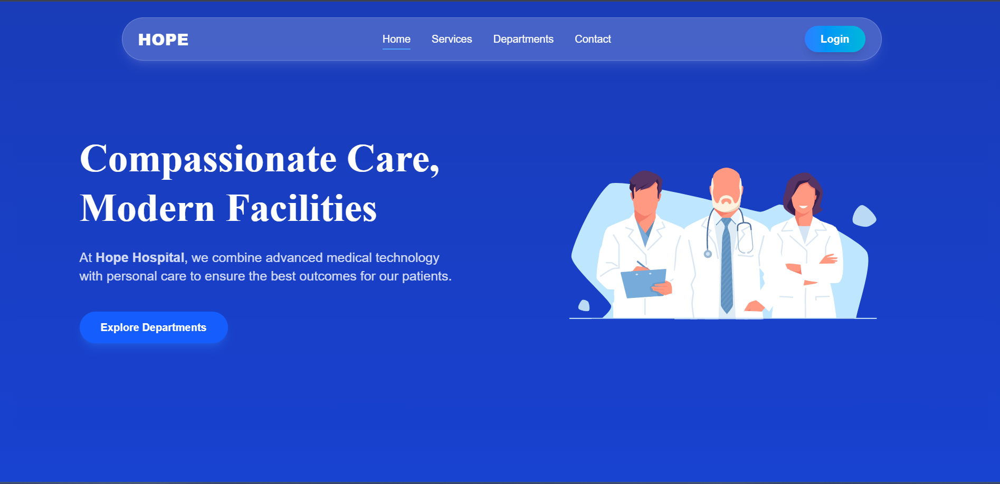
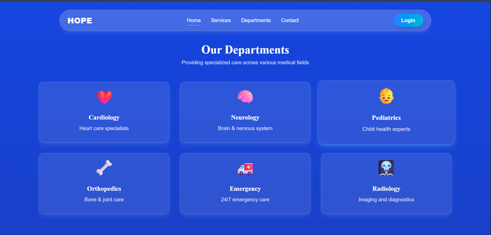
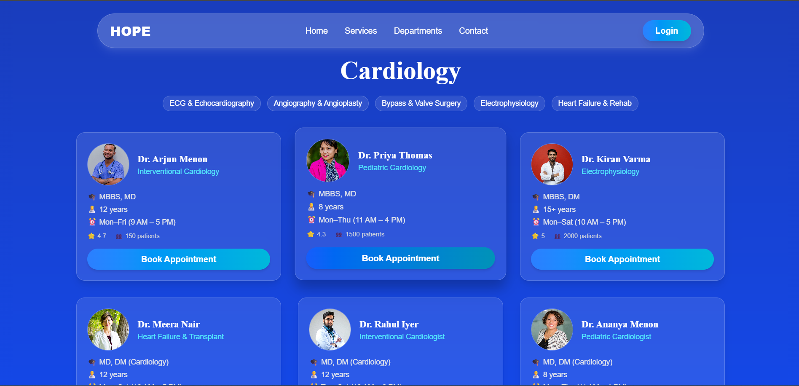
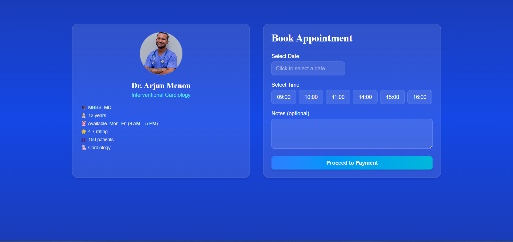
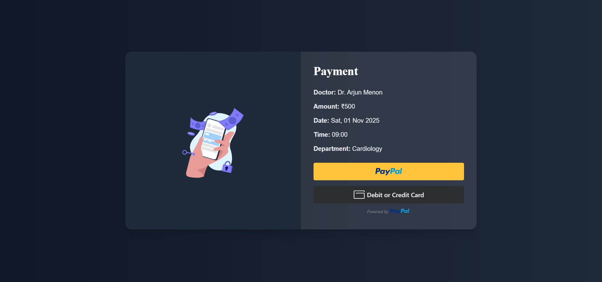
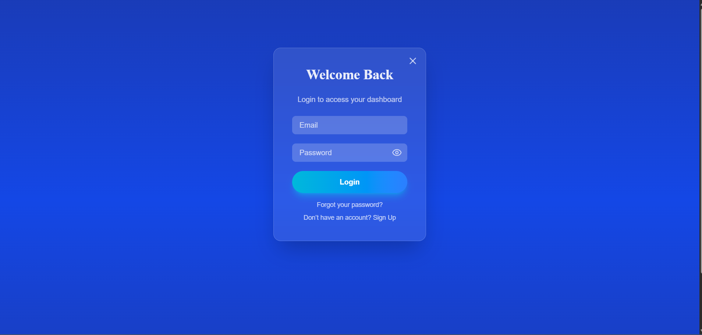
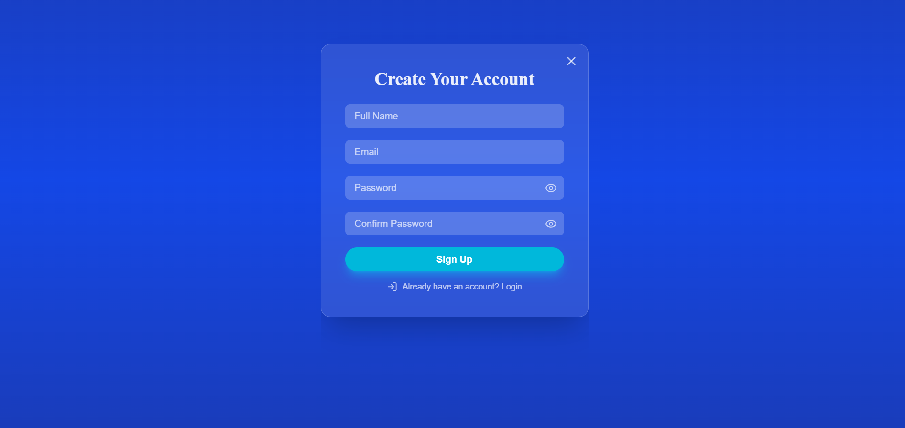
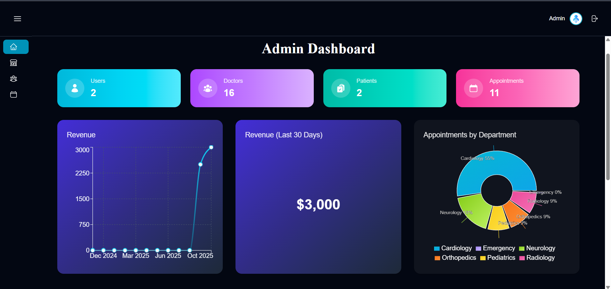

# Hope - Hospital Management System 

Built a full-stack hospital management system using React for the frontend and Django REST Framework for the backend.
 Developed a custom admin dashboard with interactive charts and analytics to monitor appointments, payments, and doctor
 activity.
 Implemented secure email-based authentication with verification and password reset functionality.
 Integrated PayPal payment gateway to enable safe and seamless online payments for consultations.
 Created a dynamic doctors page displaying profiles, specialties, and available time slots fetched from the backend API.

## Used By

This project is used by the following organizations and teams:

Aetheria General Hospital – for managing appointments, doctor schedules, and patient records.

Medicare Plus Clinics – for handling online consultations and secure payment processing.

CareWell Diagnostics – for tracking doctor activity and analytics through the admin dashboard.

Nova Health Center – for managing patient authentication and report delivery.

## Tech Stack

Frontend: React, React Router, Axios, Tailwind CSS

Backend: Django, Django REST Framework

Database: PostgreSQL 

Authentication & Security: JWT, SMTP (for email verification and password reset)

Payments: PayPal REST API

Analytics & Charts: Recharts

Version Control: Git & GitHub

## 🎥 Demo

---

## Screenshots

### Homepage

### Departments

### DoctorsCard

### AppointmentPage

### AppointmentPage

### Dashboard

### Login

### Signin

### Admin
